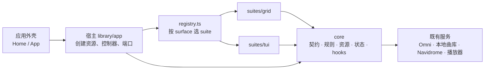

<!-- docs/library-suites.md：音乐库浏览的 headless core 与 UI suite 之间的关系，以及一套 UI 可以 / 建议实现的 core 能力。 -->

# 音乐库：core 与 UI suite

这份文档讲清楚两件事：

1. 音乐库浏览（首页、集合详情、歌手页）的代码怎么分成「core」和「UI suite」，它们之间怎么配合；
2. 想写一套新的 UI 时，core 提供了哪些能力、哪些建议实现、哪些可以不做。

代码都在 `src/library/` 下。现状以 `headless-library-p0p1` 分支为准（目前有两套 suite：默认的 `grid`，以及只在开发版出现的 `tui`）。

## 一句话

**core 负责「数据和规则」，suite 负责「长什么样、怎么操作」。** core 说「这个歌单现在能删歌、能订阅」；suite 决定「删歌是点卡片上的红色按钮，还是按 Delete 键」。同一份数据、同一套规则，可以有任意多套 UI。

## 四个角色

| 角色 | 位置 | 做什么 | 不做什么 |
| --- | --- | --- | --- |
| core | `src/library/core/` | 定义能力；加载、缓存、分页；判定「此刻能不能做」；执行删歌、订阅等动作；保存筛选词、选中项、焦点 | 不知道任何 UI 长什么样，不 import 任何 suite 或组件 |
| suite | `src/library/suites/<id>/` | 把 core 的数据画出来，把按键 / 点击映射成 core 的动作；声明自己实现了哪些能力 | 不自己请求数据，不直接调 Omni / Navidrome / 本地曲库服务，不 import 别的 suite |
| 宿主 | `src/library/app/` | 为当前打开的页面创建资源和控制器，接好播放、编辑等端口，挂载共用的对话框，通过 registry 渲染当前 suite | 不画具体界面 |
| registry | `src/library/registry.ts` | 自动发现 `suites/*/entry.ts`；给定「哪个页面 + 用户选了哪套 suite」，返回该渲染的组件和它声明的动作 | — |

core 内部再分五层，依赖只能从上往下：

| 层 | 目录 | 内容 |
| --- | --- | --- |
| contracts | `core/contracts/` | 只有类型：能力清单、各页面的 props、资源快照、端口接口 |
| model | `core/model/` | 纯函数：筛选、条目身份、批量范围、能力判定 |
| services | `core/services/` | 资源（加载、分页、缓存、作废晚到结果）、动作控制器 |
| state | `core/state/` | zustand store：浏览会话、目录会话、隐藏项、当前 suite |
| bindings | `core/bindings/` | React hooks：订阅资源、读写会话、拿到动作 |

这些依赖规则由 `test/unit/library/layerBoundaries.test.ts` 和 `dev/mcp/ts-code-map/codemap.mjs` 检查，违反会直接报错。

## 一次「打开歌单并删一首歌」是怎么走的

1. 用户在首页点开一个歌单。首页只调用 `onOpenGridView(歌单描述)`，导航 store 记下「现在打开的是它」。
2. 宿主看到导航变化：为这个歌单拿到一份**资源**（负责加载曲目）和一个**变更控制器**（负责删歌、订阅等）。宿主自己不订阅它们。
3. 宿主问 registry：「`collection` 页面，用户选的是 tui，该用谁？」registry 返回 TUI 的集合组件，以及 TUI 声明的动作清单。
4. TUI 组件订阅资源，拿到曲目，画成列表。
5. 用户按 Delete。TUI 调 `mutations.removeEntry({ entryKey, track })`。
6. 控制器先问 core 的规则「这个歌单能删歌吗」，再调上游接口；上游确认后，更新资源。
7. 资源一更新，**所有订阅它的 UI 同时看到**。如果这时切回网格，网格拿到的是同一份资源：不重新请求，筛选词和焦点也还在（它们在浏览会话里，不在组件里）。

网格删歌时有 460ms 的卡片退出动画。动画是网格自己的事：它在展示层「按住」旧的一帧，动画放完再提交。core 不等动画，TUI 也不受影响。

## 能力是怎么定义的

core 把能力分成两级：

- **surface（页面）**：`home`（首页与目录）、`collection`（集合详情）、`artist`（歌手页）。
- **动作**：每个 surface 上的语义动作，例如集合页的 `play-scope`（播放当前筛选范围）、`remove-entry`（删掉一个条目）。

一个动作最终出现在 UI 和命令面板里，要同时满足两条：

| 条件 | 谁说了算 | 例子 |
| --- | --- | --- |
| core 判定「这个对象此刻能做」 | core 的规则（`core/model/*Capabilities`、`*Surface`） | 别人的歌单不能删歌；加载中不能重新拉取 |
| suite 声明「我的 UI 做这件事」 | suite 的 `entry.ts` | TUI 没有歌单选择器，所以不声明 `add-to-playlist` |

**没实现的 surface 会回退到默认 suite（grid）**：某套 suite 没有歌手页，打开歌手时就由网格渲染，用户照样能用。**没声明的动作**则既不出现在这套 UI 上，也不出现在命令面板里，避免「面板里有、界面上却做不到」。

suite 还可以有自己的「局部动作」（`extraActions`），它们不属于 core。例如网格的「开关信息面板」「开关曲目侧栏」「编辑模式」。

## 宿主交给每个页面的东西

不管是哪套 suite，同一个页面拿到的输入完全一样（类型在 `core/contracts/suite.ts`）：

| 页面 | 主要输入 |
| --- | --- |
| collection | `collection`（描述）、`resource`（曲目资源）、`mutations`（变更控制器）、`playback`（播放端口）、导航（`onBack` / `onOpenAlbum` / `onOpenArtist`）、`declaredActions`、`isInteractive` |
| artist | `collection`、`resource`（歌手资源：详情、热门歌曲、专辑）、`playback`、导航、`onEditEntity`、`declaredActions`、`isInteractive` |
| home | 首页数据（账户、歌单、本地曲库……）、`homeResources`（收藏专辑、电台 feed、首页动作、Navidrome 概览、文件夹树）、`directoryActions`（目录批量动作）、`onOpenGridView`、`declaredActions`、`isInteractive` |

`isInteractive` 为 false 时（例如另一层盖在上面、或正在退场），页面不要接键盘、不要往命令面板注册。

## 能力清单：哪些建议实现

分级的意思：

- **基础**：不做的话，这套 UI 在这个页面基本没法用。
- **推荐**：常用；做起来不难，core 已经把规则和动作都备好了。
- **可选**：低频，或者需要额外的交互（输入框、确认框、选择器）。不做也没关系，用户可以切回网格完成。

### 集合详情（`collection`）

建议**第一个**实现的页面：它是浏览的核心。

| 动作 | 是什么 | 分级 | 用到的 core |
| --- | --- | --- | --- |
| `play` | 播放某一首（队列 = 当前筛选范围） | 基础 | `useCollectionActions().playTrack` |
| `enqueue` | 某一首加入队列 | 基础 | `.enqueueTrack` |
| `play-scope` | 播放当前筛选范围 | 基础 | `.playScope` |
| `enqueue-scope` | 当前筛选范围加入队列 | 基础 | `.enqueueScope` |
| `filter` | 按关键词筛选 | 基础 | `useLibrarySessionQuery` + 命令面板筛选框（`useGridCommandFilter`） |
| `reload` | 跳过缓存重新拉取在线集合 | 推荐 | `.reload`，能力 `capabilities.reload` |
| `resume-sync` | 后台补页中断后续传 | 推荐 | `.resumeSync`；快照的 `sync.status === 'interrupted'` |
| `remove-entry` | 删一首（每日推荐里是「不喜欢」） | 推荐 | `mutations.removeEntry`；能力 `capabilities.removeEntry` |
| `subscribe` | 收藏 / 取消收藏歌单或专辑 | 推荐 | `mutations.toggleSubscribe`；快照 `subscribed` / `subscribing` |
| `sort` | 本地文件夹排序 | 推荐（有本地曲库时） | `useLocalTrackSortStore` |
| `rename` | 改名（本地 / Navidrome 歌单） | 可选，需要输入框 | `mutations.rename` |
| `delete-collection` | 删除歌单 / 文件夹 | 可选，需要确认 | `mutations.deleteCollection` |
| `resync-folder` / `resync-all-folders` | 重新扫描文件夹 | 可选 | `mutations.resyncFolder` / `resyncAllFolders` |
| `export-playlist` | 导出本地歌单 | 可选 | `mutations.exportPlaylist` |
| `edit-entity` / `organize-song-info` / `match-song` | 打开宿主的编辑 / 整理 / 匹配对话框 | 可选，几乎零成本（对话框由宿主提供） | `mutations.editEntity` / `organizeSongInfo` / `matchSong` |
| `daily-date` | 切换每日推荐的历史日期 | 可选 | `mutations.setDailyDate` |
| `add-to-playlist` / `create-playlist` | 加入 / 新建 Navidrome 歌单 | 可选，需要歌单选择器 | `mutations.addToPlaylist` / `createPlaylist` |
| `open-album` / `open-artist` | 打开曲目上的专辑 / 歌手（嵌套压栈） | 推荐 | `resolveTrackAlbumLink` / `resolveTrackArtistLinks`（`core/model/trackLinks`，在线曲目注入 `canResolveSongCatalogRef`）→ `onOpenAlbum` / `onOpenArtist` |

此外建议：

- 显示加载中、错误（`snapshot.error`，不要和「歌单本来就是空的」混在一起）、后台补页进度与中断。
- 动作结果是判别式（`ok`，或 `busy` / `stale` / `limit-reached` / `failed` …），文案由 UI 自己翻译。重复提交时控制器会返回 `busy`，UI 不需要自己防抖。
- 打开嵌套的专辑 / 歌手之前，把焦点写回浏览会话（`setFocusedEntry`）；离开（卸载、换 suite 的冲刷）时也写，但只在用户在这里动过焦点时写——没动过就写，会把会话里别处记下的焦点盖成第一行。返回时按会话里的条目键恢复焦点。

### 首页与目录（`home`）

推荐实现：让这套 UI 从首页就能开始浏览。不实现时首页由网格渲染，用户从网格点开集合后照样进入你的集合页。

页面本身（不是动作）要做的：来源与分区页签、条目列表、打开条目（`homeResources.actions.openOnlineCard` / `openLocalGroup` / `openNavidromeCard`）。core 的 hooks 是 `useLibraryHomeSources`、`useLibraryHomeOnline`、`useLibraryHomeLocal`、`useLibraryHomeNavidrome`、`useLibraryHomeDirectory`。

| 动作 | 是什么 | 分级 | 用到的 core |
| --- | --- | --- | --- |
| `directory-filter` | 筛选目录条目 | 基础 | `useLibraryDirectoryQuery` |
| `directory-select` | 批量选择（全选 / 清空 / 逐个） | 推荐 | `useLibraryDirectorySelection` |
| `directory-play-selection` / `directory-enqueue-selection` | 播放 / 入队选中的 | 推荐 | `useLibraryDirectoryActions`、`runDirectoryBatchAction` |
| `directory-manage-hidden` / `directory-toggle-hidden` | 管理隐藏的歌单 | 推荐 | `useLibraryDirectoryVisibility`、`useHiddenCollections` |
| `directory-create-playlist` | 用选中的歌新建本地歌单 | 可选，需要输入框 | 同上 |
| `directory-remove-selection` | 从曲库删除选中的 | 可选，需要确认 | 同上 |
| `directory-rescan-root` / `directory-remove-root` / `directory-clear-ignore` | 导入根的重扫、移除，恢复被忽略的文件夹 | 可选 | 同上 |
| `home-import-folder` / `home-refresh-folders` / `home-import-playlist` | 导入文件夹、刷新、导入歌单文件 | 可选 | `useLibraryHomeActions` |
| `home-refresh-navidrome` | 刷新 Navidrome 概览 | 可选 | `useLibraryHomeNavidrome().refresh` |

隐藏项的规则由 core 统一：只有「歌单类」条目能隐藏；隐藏按来源分作用域；隐藏的条目不出现在浏览、筛选和任何批量范围里，只在「管理隐藏」视图里能看到。UI 只负责显示和切换。

在线账户的登录（二维码）目前只有网格提供。别的 suite 在未登录时显示原因即可。

### 歌手页（`artist`）

可选：不实现时自动由网格渲染。

| 动作 | 是什么 | 分级 | 用到的 core |
| --- | --- | --- | --- |
| `play` / `enqueue` | 播放 / 入队某首热门歌曲 | 基础 | `playback` 端口；歌手资源的 `topSongs` |
| `open-album` | 打开歌手的某张专辑 | 基础 | `artistAlbumLink(album, collection)` → `onOpenAlbum` |
| `filter` | 按名字筛选专辑 | 推荐 | `useLibrarySessionQuery` |
| `play-scope` / `enqueue-scope` | 播放全部热门歌曲 / 整批加入队列 | 推荐 | `playback.enqueueAll(tracks, { suppressToast: true })` 返回实际收下的条数 |
| `open-artist` | 打开歌曲上的其他歌手 | 推荐 | `onOpenArtist` |
| `reload` / `resume-sync` | 加载失败时重试、专辑分页中断时续页 | 推荐 | `resource.reload()` / `resource.retryAlbums()` |
| `edit-entity` | 编辑本地歌手实体 | 可选 | `onEditEntity`（对话框由宿主提供） |

歌手资源的状态：`idle` / `loading` 显示加载中；`ready` 但没有 `detail` 是空态；`error` 显示加载失败。

## 写一套新 suite 的步骤

1. 新建 `src/library/suites/<id>/entry.ts`，默认导出一个 `LibrarySuiteManifest`：`id`、显示名（`labelKey`）、`surfaces`（每个页面的组件 + 声明的动作）。组件必须用 `React.lazy` 引入（只有默认 suite 例外）。registry 会自动发现它，不需要在别处登记。
2. 先实现 `collection`。用 core 的 hooks 拿数据和动作：`useCollectionResourceState`（订阅资源）、`useCollectionView`（筛选与范围）、`useCollectionActions`（播放、入队、重拉）、`useCollectionMutationSnapshot`（变更能力与状态）、`useLibrarySessionQuery`（筛选词）。
3. 向命令面板注册：集合页用 `useGridSurfaceRegistration` + `buildCoreSurfaceParams`（它会按你的声明过滤）；目录用 `useLibraryDirectorySurfaceRegistration`；歌手页用 `useLibraryArtistSurfaceRegistration`。只在 `isInteractive` 为真时注册。
4. 键盘：可打印字符留给命令面板（它是筛选框），空格是全局的播放 / 暂停。你的页面只用方向键、Enter（可带修饰键）、Delete、Insert、Esc、功能键这类不可打印的键。
5. 在 `entry.ts` 里如实声明你做了哪些动作。没把握的先别声明：它会自动在命令面板里消失，用户切回网格就能做。
6. 测试：`test/component/libraryBehavior.spec.ts`、`homeBehavior.spec.ts`、`artistBehavior.spec.ts` 里的语义用例按 suite 参数化。把你的 suite 加进去，同一批场景会对它再跑一遍。

## 规则（写 suite 时不要做的事）

- 不要在 suite 里调用 Omni、本地曲库服务、Navidrome 服务或 `core/services`。数据和动作都由宿主经 props 交给你。
- 不要 import 别的 suite（包括网格的卡片、六边形视口、转场）。需要共享的东西应放进 core。
- 不要自己实现删歌、订阅、批量范围这类规则，用 core 的。否则两套 UI 会对同一个动作给出不同的结果。
- 不要把筛选词、选中项、焦点存在组件 state 里。它们在会话 store 里，切换 suite 时才不会丢。
- 布局相关的东西（滚动位置、坐标、展开状态）属于 suite 自己，不要放进 core。

## 两套现有 suite 的对照

| 页面 | grid（默认） | tui（开发版） |
| --- | --- | --- |
| home | 全部 | 全部；二维码登录除外（未登录只显示原因） |
| collection | 全部，另有信息面板、曲目侧栏、编辑模式三个局部动作 | 除 `add-to-playlist` / `create-playlist` 外全部（P4.4 起行上的歌手 / 专辑可打开，Alt+Enter / Alt+Shift+Enter） |
| artist | 全部 | 全部（P4.3 起；之前回退到网格） |

开发版左下角的浮层可以在两套之间切换；切换不重新请求，筛选、选中和焦点都保留。

## 相关文件

- 能力契约：`src/library/core/contracts/suite.ts`
- suite 发现与回退：`src/library/registry.ts`、`src/library/core/model/librarySuites.ts`
- 两套 suite 的声明：`src/library/suites/grid/entry.ts`、`src/library/suites/tui/entry.ts`
- 宿主：`src/library/app/GridViewOverlayHost.tsx`（集合与歌手页）、`src/components/app/Home.tsx`（首页）
- 分层规则：`skills/codebase-navigation/SKILL.md` 的 Boundaries 段、`test/unit/library/layerBoundaries.test.ts`
